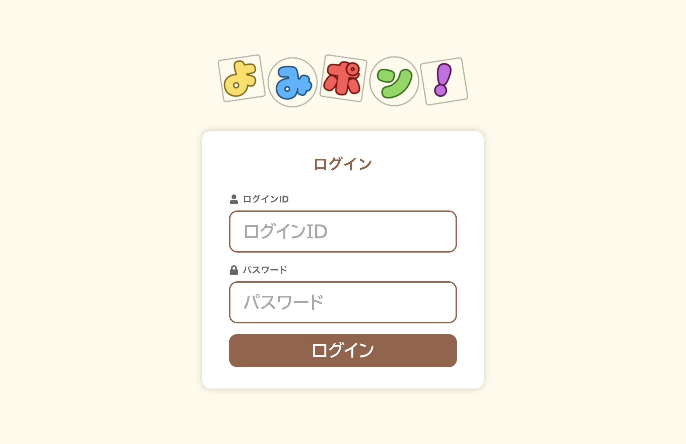
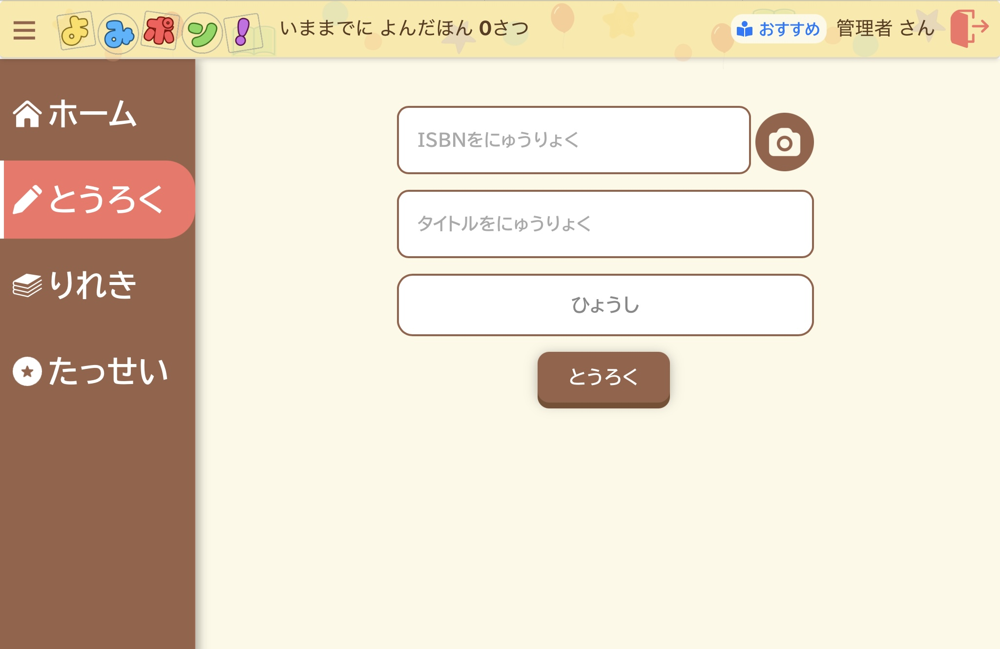
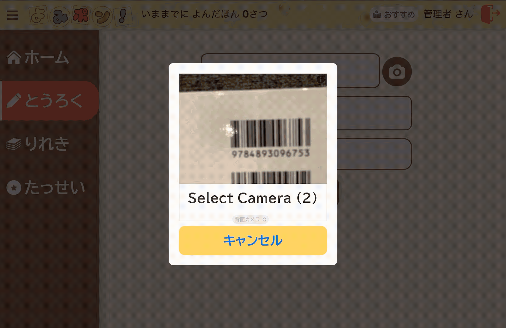
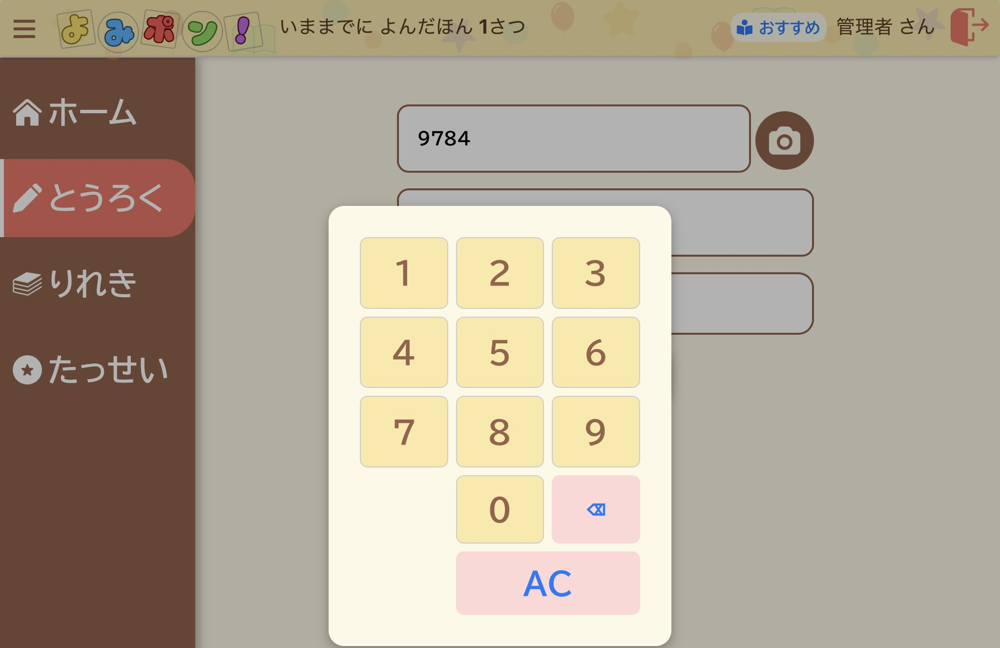

# 子ども向け読書管理アプリ
## 概要
自身の子どものために開発したアプリ。 
毎日絵本の読み聞かせをしているので、その際に読んだ本を管理したり、たくさん読んだことを実感できたりするようなアプリがあればと思い開発した。タブレット操作に少し慣れてきた娘でも操作できるように、たくさん本を読みたいと思えるようなきっかけになるような仕掛けや工夫を行った。

## 主な機能
| 機能 | 内容 |
|------|------|
|ログイン|ユーザーごとの読書履歴の管理。 権限の切り分け。|
|本の登録|ISBNをバーコードで読み取る、または手入力 ISBNを国会図書館やopenBDが提供するAPIを利用し、本の情報を取得|
|履歴管理|登録した本の履歴を管理。 タイトルや書影、自分のお気に入りかどうかなどを管理し、一覧表示|
|達成状況の確認|月ごとの登録数を表示したり、最多登録した本を表示など、読書状況のふり返りが可能|
|登録数でスタンプラリー|本の登録数に合わせて、スタンプラリー形式の表示。|
|おすすめ本の提示|Grokを使用して、ユーザーに合わせたおすすめの本を表示。|

## 画面イメージ
ログイン画面

登録画面

バーコード読み取り

テンキー表示

履歴画面

